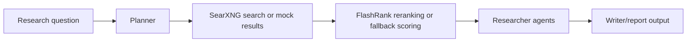

# Architecture

LangGraph research-team workflow combining SearXNG search, FlashRank reranking, Gemini summaries, and explicit fallback metadata.

This document is written for reviewers who want to understand how the project is shaped before reading the code. It emphasizes boundaries, dependencies, and degraded paths rather than marketing claims.

## Data Flow

1. Research question
2. Planner
3. SearXNG search or mock results
4. FlashRank reranking or fallback scoring
5. Researcher agents
6. Writer/report output

## Main Components

- **Search client**: Calls SearXNG and records degraded state on service failures.
- **Reranker**: Uses FlashRank when available and labels fallback scoring.
- **LangGraph workflow**: Coordinates planning, research, and writing nodes.
- **Report model**: Carries warnings/metadata so degraded evidence is visible.

## External Dependencies

- Python 3.11+
- Optional SearXNG
- Optional FlashRank
- Optional Gemini API key
- LangGraph/LangChain dependencies

The project is intentionally explicit about optional services. Mock, fallback, and degraded paths are labeled in result metadata so a demo cannot be mistaken for a successful production integration.

## Failure And Degraded Modes

- External-service failures are captured as warnings, status fields, or source metadata where the domain model supports it.
- Mock/demo behavior is opt-in or explicitly labeled.
- Generated outputs are treated as review candidates, not authoritative decisions.
- CLI output remains user-facing; library internals use logging or structured metadata.

## What To Review In Code

- Search/reranking failures propagate as warnings rather than disappearing.
- Reports carry metadata about fallback search and LLM paths.
- Docs explain evidence quality and review expectations.

## Current Limits

- Research reports require source review before use.
- Search quality depends on configured SearXNG sources.
- Fallback reranking is keyword-based and visibly degraded.
